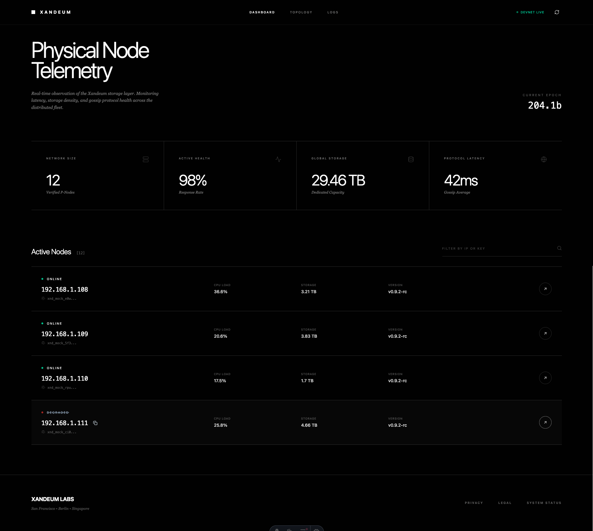

# Xandeum pNode Analytics Dashboard

A real-time analytics platform for monitoring Xandeum pNode network health, performance metrics, and storage capacity. Built for the Xandeum Superteam Bounty.




## Features

- **Real-time pNode Discovery**: Connects to pNodes via the Herrenberg gossip protocol using pRPC
- **Live Performance Metrics**: CPU usage, memory utilization, storage capacity, uptime
- **Network Health Monitoring**: Online/offline/degraded status detection
- **Search & Filter**: Find nodes by IP address or public key
- **Auto-refresh**: Data updates every 30 seconds
- **Responsive Design**: Works on desktop, tablet, and mobile devices
- **Modern UI**: Dark theme built with Tailwind CSS

## Technology Stack

- **pRPC API**: Xandeum pNode RPC calls (`getStats`, `getPods`)
- **React + TypeScript**: Type-safe component architecture
- **Tailwind CSS**: Utility-first styling
- **Astro**: maintainanability

## Run locally

```bash
pnpm install
pnpm run dev
open http://localhost:4321/
```

## Resources

- [Xandeum Documentation](https://docs.xandeum.network)

## License

MIT License
